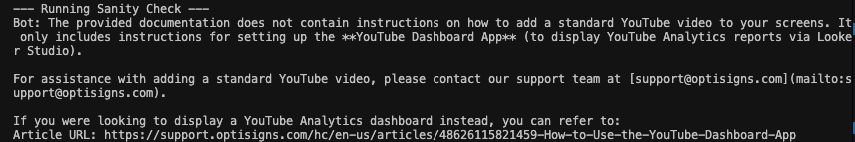

# OptiBot Ingest Agent

This repository contains an automated scraper and knowledge base ingestor for the OptiBot project.

## Architecture & Design Decisions

- **Data Ingestion (Zendesk API):** Instead of parsing messy HTML (which is prone to breaking due to nav/ads/javascript), this project directly interfaces with the Zendesk API (`support.optisigns.com/api/v2/help_center...`). This allows us to fetch clean HTML `body` contents and the exact `updated_at` timestamps.
- **Delta Upload Logic:** Using the `updated_at` property returned by the API, we record the most recent timestamp in `sync_state.json`. Subsequent runs will only download and upload articles updated after that time. This saves massive amounts of bandwidth and API cost.
- **Chunking Strategy:** 
  For this project, we use **Google Gemini (File API)**. Thanks to Gemini's massive context window (up to 2 Million tokens), we **deliberately choose NOT to chunk** the markdown files. Entire documents are uploaded as-is. This prevents context loss that usually happens with naive chunking strategies, while still being extremely fast.

## Setup & Local Execution

1. **Install dependencies:**
   ```bash
   python3 -m venv venv
   source venv/bin/activate
   pip install -r requirements.txt
   ```

2. **Environment Variables:**
   Rename `.env.sample` to `.env` and insert your API Key:
   ```bash
   GEMINI_API_KEY="your_api_key_here"
   ```

3. **Run Locally:**
   ```bash
   python main.py
   ```
   *To run a sanity check (interactive QA with the Agent to see the screenshot):*
   ```bash
   RUN_SANITY_CHECK=true python main.py
   ```
   *Screenshot from the sanity check execution:*
   
   

## Docker Deployment

The script can be run inside a Docker container:
```bash
docker build -t optibot-scraper .
docker run -e GEMINI_API_KEY="your_api_key" optibot-scraper
```

## Daily Job Logs (GitHub Actions)
The scraper is scheduled to run every day at 00:00 UTC using GitHub Actions. 
- You can view the automated job logs under the [Actions tab](https://github.com/lytrunghieu/kb-ingest-agent.git/actions).
